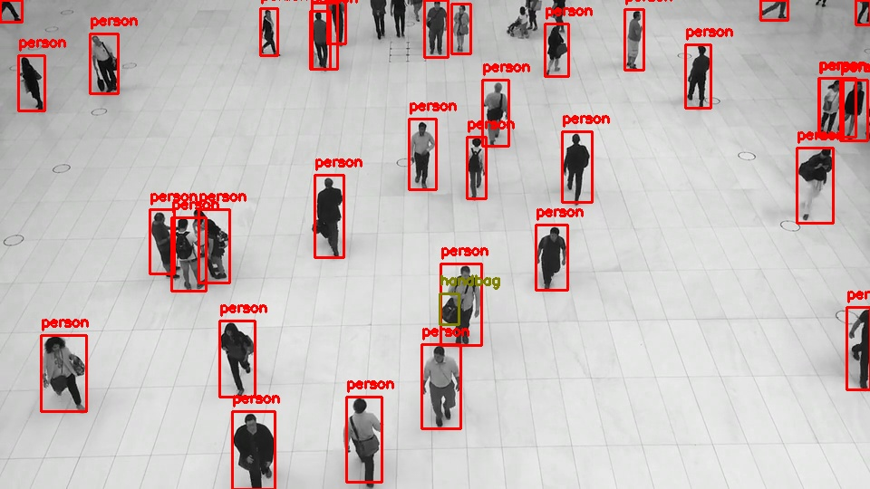
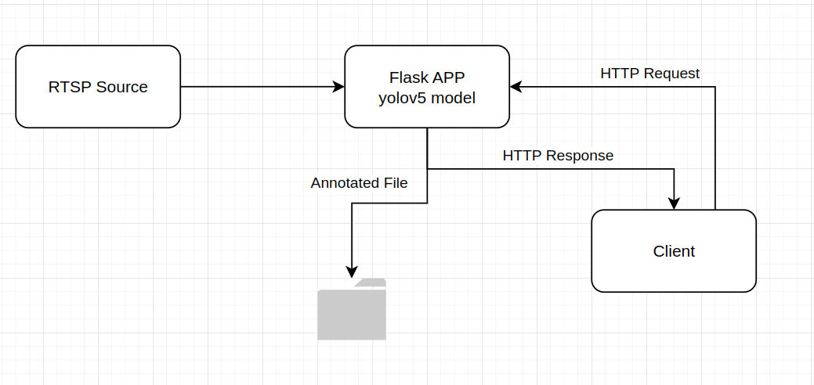
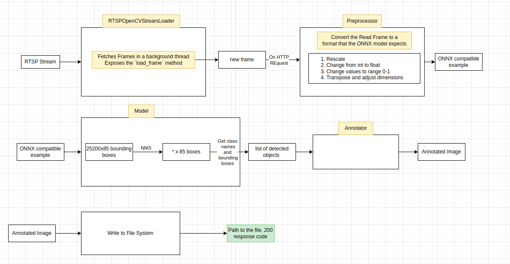

# Yolo on an RTSP stream with Flask
#

This is a simple project to demonstrate how to use YOLOv5 to detect objects in an RTSP stream. 

The project uses Flask to server a webpage.

* The Server continuously reads frames from the RTSP stream in the background
* Upon a request from the client, the server reads the latest frame and runs YOLOv5 on it, annotates the frame and saves it to a file
* The server then responds with the path for the annotated file

Here's how it looks like



# How to run the project
1. Clone the project
2. Run `docker compose up`
3. Run the client script `python client.py`, or send a request via curl to `http://localhost:8080/object_detection`
4. You should see the output in the `output` directory

## 1.RTSP Server
* I found this opensource project https://github.com/bluenviron/mediamtx to be very useful. 
* It's basically a multimedia app that acts as a server to stream media in different formats and protocols, including RTSP
* I used their docker image to run the RTSP server
* The RTSP server plays a video on loop to simulate a live stream
* This is all configured in the [mediamtx.yml file](./rtsp-server/mediamtx.yml)

#### 1.1 The meaning of the fields in the mediamtx.yml file
```yaml
paths:
  stream:
    runOnInit: >
      ffmpeg -re 
      -stream_loop -1
      -i /stock_video.mp4
      -c copy 
      -f rtsp 
      rtsp://localhost:$RTSP_PORT/$MTX_PATH
```
* `paths`: The path to the stream. This is the path that the client will use to connect to the stream, like 
* `stream` is the name I chose for the stream
* `runOnInit`: The command to run when the server starts. It's an ffmpeg command to load a video on repeat and stream it over RTSP

#### 1.2 The dockercompose entry for the RTSP server
```yaml
  rtsp_server:
    image: bluenviron/mediamtx:1.5.1-ffmpeg
    container_name: rtsp_server
    ports:
      - 8554:8554
      - 1935:1935
      - 8888:8888
      - 8889:8889
      - 8890:8890/udp
      - 8189:8189/udp
    volumes:
      - ./${STOCK_VIDEO_RELATIVE_PATH}:/stock_video.mp4
      - ./rtsp-server/mediamtx.yml:/mediamtx.yml
```
* I'm using the `bluenviron/mediamtx:1.5.1-ffmpeg` image to run the RTSP server. I'm also mounting the `mediamtx.yml` file and the stock video file to the container.
* To mount your own custom video, change the `STOCK_VIDEO_RELATIVE_PATH` in the `.env` file to be the path to your video file relative to the root of the project

## 2. The Flask Server
* The Flask server is the main server that serves the `/object_detection` endpoint and handles the RTSP stream
* Here's how it's structured


#### 2.1 The StreamLoader Class
* The `StreamLoader` class is a background thread that reads frames from the RTSP stream, and updates `_current_frame` attribute. This is inspired by how the [yolov5 project](https://github.com/ultralytics/yolov5/tree/master) does it.

#### 2.2 The Preprocessor Class
* The `Preprocessor` class is responsible for preprocessing the frame before it's fed to YOLOv5. This includes resizing the frame, normalizing it, and converting it to a numpy array with the dimensions that the ONNX model expects, which is `1x3x640x640`

#### 2.3 The Model Loader Class
* The Model Loader class tries to load the model from the local file, specified by the `ONNX_LOCAL_FILE_PATH` env var. If the file doesn't exist, it downloads the model from the internet and saves it to the file.

#### 2.4 The Model Class
* It's a wrapper around the YOLOv5 model. It's responsible for running the model on the frame, and doing postprocessing on the output to get the bounding boxes and labels

#### 2.6 The Annotator Class
* The Annotator class is responsible for drawing the bounding boxes and labels on the original frame.

#### 2.7 Configurations
* There're environment variables to configure the behavior of the server, 

```
# RTSP_CONSTANTS
RTSP_URL=rtsp://rtsp_server:8554/stream
THREAD_RETRY_INTERVAL=5

# YOLO constants
IOU_THRESHOLD=0.5
OBJECT_DETECTION_SCORE=0.4

# change this to whichever model version you like, like medium, large, etc
ONNX_FALLBACK_DOWNLOAD_URL=https://github.com/ultralytics/yolov5/releases/download/v7.0/yolov5s.onnx
ONNX_LOCAL_FILE_PATH=yolov5.onnx

```
* `RTSP_URL`: The URL of the RTSP stream
* `THREAD_RETRY_INTERVAL`: The interval in seconds to wait before retrying to connect to the RTSP stream
* `IOU_THRESHOLD`: The IOU threshold for non-maximum suppression
* `OBJECT_DETECTION_SCORE`: The score threshold for the detected objects, also used in non-maximum suppression
* `ONNX_FALLBACK_DOWNLOAD_URL`: The URL to download the ONNX model from if it doesn't exist. Defaults to the small model
* `ONNX_LOCAL_FILE_PATH`: The path to the local file where the ONNX model is saved

## 3. The Client
* The client is a simple python script that relies only on python's standard library to send a request to the server and return the path to the annotated frame

## 4. What else is there?:
* There're tests in the `tests` directory to test the StreamLoader, the model's postprocessing methods
* There're Github workflows that trigger a CI pipeline on every push to the main branch
  * It runs the tests, and if they're successful, builds a docker image
  * You can modify the `docker-compose` file to include the latest image instead of building it from the source code
  ```
  ghcr.io/hkhairy/flask_app:latest
  ```

## Why ONNX and not torch? 🤔
* According to yolo's benchmarks, running yolov5 with ONNX on CPU is faster than torch
    * It takes about 140ms to run the `s` model on a frame with ONNX on CPU 🔥
* I don't want to install the extra bloat of torch, torchvision, and etal  in my docker image 😂


## TODOs
* Add Prometheus metrics to the Flask server to measure latency, number of requests, memory usage, cpu usage
* Use OpenCV dnn module to run the ONNX model directly, without even needing the ONNXRuntime

* Make the connection to the RTSP server more secure. The mediamtx container supports user/password authentication, as well as SSL certificates for encryption
* Redesign the classes to be more modular and testable
* Configure linter and static type checker, and add them to the CI workflow